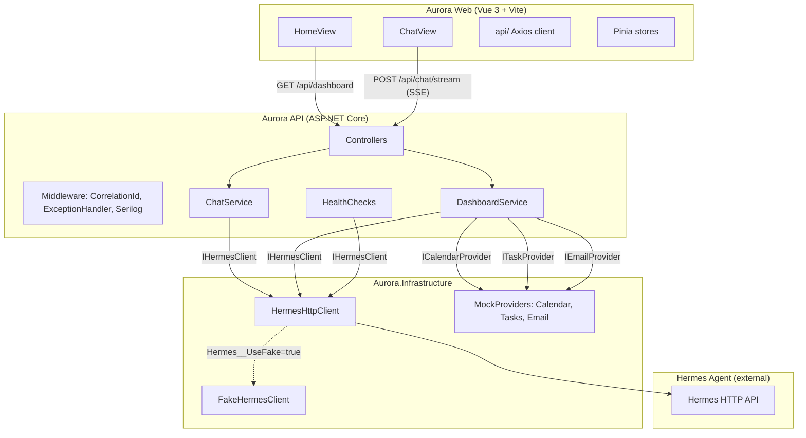

# Aurora AI MVP Design

**Spec**: `.specs/features/aurora-mvp/spec.md`
**Status**: Approved

---

## Architecture Overview

Pragmatic Clean Architecture: controllers are thin, application services own orchestration, infrastructure wires external dependencies. No generic repositories, no CQRS handlers for simple reads, no event bus in MVP.



**Key decisions:**
- Frontend → Aurora API only (never directly to Hermes)
- SSE over WebSockets (simpler, no upgrade handshake, works over HTTP/1.1)
- FakeHermesClient registered via config flag for full-stack dev without Hermes
- Mock providers (ICalendarProvider etc.) allow dashboard to compile and serve now; swapped for real impls in Phase 2

---

## Code Reuse Analysis

Fresh project — no existing code. All components are created from scratch following the patterns documented here.

### Integration Points

| System | Integration Method |
| ------ | ------------------ |
| Hermes Agent | HTTP POST/streaming via `HermesHttpClient`; URL from `Hermes__BaseUrl` config |
| Browser SSE | `Response.Body` written directly with `text/event-stream` content type |
| Frontend ↔ Backend | Axios instance with `VITE_AURORA_API_URL` base URL; SSE via native `EventSource` |

---

## Backend Components

### Aurora.Domain

Minimal domain layer — only genuinely shared types.

- **Purpose**: Central shared contracts that have no infrastructure dependency.
- **Location**: `src/Aurora.Domain/`
- **Contents**:
  - `Entities/` — none for MVP (chat is stateless; no persistence)
  - `Exceptions/HermesException.cs` — domain exception for Hermes communication failures
- **Dependencies**: None (no project references)

---

### Aurora.Contracts

Public API surface — requests, responses, DTOs.

- **Purpose**: Shared request/response types between Api and Application layers. No business logic.
- **Location**: `src/Aurora.Contracts/`
- **Interfaces**:
  - `Chat/ChatRequest.cs` — `{ string Message, string? ConversationId }`
  - `Chat/ChatResponse.cs` — `{ string ConversationId, string Message }`
  - `Chat/ChatStreamEvent.cs` — `{ string EventType, string? Content, string? Tool, string? ConversationId }`
  - `Dashboard/DashboardResponse.cs` — full schema per AURORA-05
- **Dependencies**: None

---

### Aurora.Application

Use cases and service interfaces.

- **Purpose**: Orchestrates domain logic; defines interfaces that Infrastructure implements.
- **Location**: `src/Aurora.Application/`
- **Contents**:
  - `Interfaces/IHermesClient.cs`
  - `Interfaces/ICalendarProvider.cs` — `Task<CalendarSummary> GetTodaySummaryAsync(CancellationToken ct)`
  - `Interfaces/ITaskProvider.cs` — `Task<TaskSummary> GetPendingCountAsync(CancellationToken ct)`
  - `Interfaces/IEmailProvider.cs` — `Task<EmailSummary> GetImportantCountAsync(CancellationToken ct)`
  - `Chat/ChatService.cs` — wraps `IHermesClient.ChatAsync`
  - `Chat/ChatStreamingService.cs` — wraps `IHermesClient.StreamChatAsync`, yields SSE events
  - `Dashboard/DashboardService.cs` — aggregates providers + Hermes health
- **Dependencies**: Aurora.Contracts, Aurora.Domain

---

### Aurora.Infrastructure

External integrations and mock providers.

- **Purpose**: Implements application interfaces using real HTTP calls or mocks.
- **Location**: `src/Aurora.Infrastructure/`
- **Contents**:
  - `Hermes/IHermesClient.cs` — (interface lives in Application; impls here)
  - `Hermes/HermesHttpClient.cs`
  - `Hermes/FakeHermesClient.cs`
  - `Hermes/HermesOptions.cs` — `{ string BaseUrl, bool UseFake }`
  - `Mocks/MockCalendarProvider.cs`
  - `Mocks/MockTaskProvider.cs`
  - `Mocks/MockEmailProvider.cs`
  - `Logging/` — Serilog configuration helpers
- **Dependencies**: Aurora.Application, Aurora.Domain

---

### Aurora.Api

Host project — controllers, middleware, DI wiring.

- **Purpose**: HTTP entry point. Thin controllers, middleware pipeline, Swagger, health checks, CORS.
- **Location**: `src/Aurora.Api/`
- **Contents**:
  - `Controllers/ChatController.cs` — POST /api/chat, POST /api/chat/stream
  - `Controllers/DashboardController.cs` — GET /api/dashboard
  - `Middleware/CorrelationIdMiddleware.cs`
  - `Middleware/ExceptionHandlerMiddleware.cs`
  - `Extensions/ServiceCollectionExtensions.cs` — DI wiring
  - `Program.cs`
  - `appsettings.json`, `appsettings.Development.json`
- **Dependencies**: Aurora.Application, Aurora.Infrastructure, Aurora.Contracts

---

### IHermesClient Interface

```csharp
public interface IHermesClient
{
    Task<ChatResponse> ChatAsync(ChatRequest request, CancellationToken cancellationToken);
    IAsyncEnumerable<ChatStreamEvent> StreamChatAsync(ChatRequest request, CancellationToken cancellationToken);
    Task<bool> IsHealthyAsync(CancellationToken cancellationToken);
}
```

---

### HermesHttpClient

Reads `Hermes__BaseUrl` from `IOptions<HermesOptions>`. Uses `IHttpClientFactory`. On non-2xx throws `HermesException`. For streaming, reads response body line-by-line parsing `event:` and `data:` fields and yielding `ChatStreamEvent` records. Respects `CancellationToken` on each iteration.

---

### FakeHermesClient

`ChatAsync` — returns a `ChatResponse` with a canned message after a 200ms fake delay.

`StreamChatAsync` — yields:
1. `{ EventType = "message.started" }`
2. `{ EventType = "message.delta", Content = "Boa noite! ✨" }`
3. `{ EventType = "message.delta", Content = "\n\nEstou online e pronta para ajudar." }`
4. `{ EventType = "message.completed", ConversationId = <new Guid> }`

`IsHealthyAsync` — always returns `true`.

---

### ChatController SSE Streaming

```
POST /api/chat/stream
Content-Type: application/json

→ sets Response.ContentType = "text/event-stream; charset=utf-8"
→ disables response buffering (IHttpBodyControlFeature)
→ foreach event in ChatStreamingService.StreamAsync(request, ct):
     writes "event: {event.EventType}\ndata: {json}\n\n"
     flushes immediately
→ on OperationCanceledException: returns (client disconnected)
→ on HermesException: writes error event, closes
```

---

### DashboardService

```csharp
public async Task<DashboardResponse> GetDashboardAsync(CancellationToken ct)
{
    var hermesHealthy = await _hermesClient.IsHealthyAsync(ct);
    var agenda = await _calendarProvider.GetTodaySummaryAsync(ct);
    var tasks = await _taskProvider.GetPendingCountAsync(ct);
    var emails = await _emailProvider.GetImportantCountAsync(ct);
    return new DashboardResponse
    {
        Greeting = ComputeGreeting(),
        Aurora = new() { Status = "online" },
        Agenda = new() { EventsToday = agenda.Count, NextEvent = agenda.Next },
        Tasks = new() { Pending = tasks.Count },
        Emails = new() { Important = emails.Count },
        System = new() { Api = "online", Hermes = hermesHealthy ? "online" : "offline", Memory = "unknown" }
    };
}
```

Greeting logic: `< 12 → "Bom dia"`, `12–17 → "Boa tarde"`, `≥ 18 → "Boa noite"`.

---

## Frontend Components

### Project Layout

```
src/aurora-web/src/
├── api/
│   ├── auroraApi.ts          ← Axios instance (VITE_AURORA_API_URL)
│   ├── chatApi.ts            ← chat() and streamChat() functions
│   └── dashboardApi.ts       ← getDashboard()
├── components/
│   ├── aurora/
│   │   ├── AuroraCore.vue    ← animated visual core
│   │   └── VoiceButton.vue
│   ├── chat/
│   │   ├── ChatMessages.vue
│   │   ├── ChatMessage.vue
│   │   ├── ChatInput.vue
│   │   ├── AuroraThinking.vue
│   │   └── ToolActivity.vue
│   ├── dashboard/
│   │   ├── NextEventCard.vue
│   │   ├── TasksCard.vue
│   │   ├── SystemStatusCard.vue
│   │   └── ProjectFocusCard.vue
│   └── shared/
│       ├── ActivityFeed.vue
│       └── AudioVisualizer.vue
├── composables/
│   └── useChat.ts            ← SSE streaming logic
├── layouts/
│   └── AppLayout.vue
├── router/
│   └── index.ts              ← / and /chat
├── stores/
│   ├── aurora.store.ts       ← auroraStore: state (idle/listening/thinking/speaking/working/error)
│   ├── chat.store.ts         ← chatStore: messages, streaming flag
│   └── dashboard.store.ts    ← dashboardStore: dashboard data
├── types/
│   ├── chat.ts
│   └── dashboard.ts
├── views/
│   ├── HomeView.vue
│   └── ChatView.vue
├── App.vue
└── main.ts
```

---

### AuroraCore.vue

Pure CSS/SVG component. No external images.

States and visual behavior:
- `idle`: 3 concentric rings, slow pulse, electric blue glow
- `listening`: rings expand, cyan color, faster pulse
- `thinking`: rings rotate, purple hue, smooth spin animation
- `speaking`: wave rings pulse outward
- `working`: orbit animation (dot circling the core)
- `error`: red glow, ring stops

Implementation: CSS `@keyframes` for each state; state prop drives `class` binding.

---

### useChat.ts Composable

```typescript
export function useChat() {
  const chatStore = useChatStore()
  const auroraStore = useAuroraStore()

  async function sendMessage(message: string) {
    auroraStore.setState('thinking')
    chatStore.setStreaming(true)
    chatStore.addMessage({ role: 'user', content: message })

    const eventSource = new EventSource(/* ... POST workaround via fetch+ReadableStream */)
    // Since EventSource doesn't support POST, use fetch + ReadableStream parsing
    const response = await fetch(`${apiUrl}/api/chat/stream`, {
      method: 'POST',
      headers: { 'Content-Type': 'application/json' },
      body: JSON.stringify({ message }),
      signal: chatStore.abortController.signal
    })
    // Parse SSE from response.body using TextDecoder
    // On message.delta: append to current assistant message
    // On tool.started: update ToolActivity
    // On message.completed: finalize, set aurora state to idle
    // On error event: show error message
  }

  return { sendMessage }
}
```

Note: Browser `EventSource` doesn't support POST. We use `fetch` + `ReadableStream` + manual SSE line parsing. This is the standard approach for POST-based SSE.

---

## Data Models

### ChatRequest (Contracts)

```typescript
interface ChatRequest {
  message: string
  conversationId?: string
}
```

### ChatResponse (Contracts)

```typescript
interface ChatResponse {
  conversationId: string
  message: string
}
```

### ChatStreamEvent (Contracts)

```typescript
interface ChatStreamEvent {
  eventType: 'message.started' | 'message.delta' | 'tool.started' | 'tool.completed' | 'message.completed' | 'error'
  content?: string
  tool?: string
  conversationId?: string
}
```

### DashboardResponse (Contracts)

```typescript
interface DashboardResponse {
  greeting: string
  aurora: { status: string }
  agenda: { eventsToday: number; nextEvent: null | { title: string; time: string } }
  tasks: { pending: number }
  emails: { important: number }
  system: { api: string; hermes: string; memory: string }
}
```

---

## Error Handling Strategy

| Error Scenario | Backend Handling | Frontend Display |
| -------------- | ---------------- | ---------------- |
| Hermes unreachable (non-streaming) | HermesException → 502 JSON response | "Não consegui falar com o núcleo da Aurora." |
| Hermes unreachable (streaming) | SSE `error` event emitted | Chat error message shown |
| Empty message | FluentValidation → 400 JSON | Input validation UI |
| Network timeout | HermesException → 502 | Error message in chat |
| SSE client disconnect | CancellationToken cancelled → stream stops | N/A (client left) |
| Unhandled exception | ExceptionHandlerMiddleware → 500 JSON (no stack trace) | Generic error message |
| Missing VITE_AURORA_API_URL | Console warning, fallback to localhost:8080 | None |

---

## Risks & Concerns

| Concern | Location | Impact | Mitigation |
| ------- | -------- | ------ | ---------- |
| POST SSE not supported by browser EventSource | Frontend `useChat.ts` | Cannot use native EventSource | Use `fetch` + `ReadableStream` SSE parsing — documented pattern, tested in composable |
| Response buffering blocks SSE | `ChatController` | Events not flushed immediately | Disable buffering via `IHttpBodyControlFeature`; set `Response.Headers["Cache-Control"] = "no-cache"` |
| .NET version availability | `Aurora.sln` | Build fails if .NET 10 not installed | Target net9.0 with a TODO comment; upgrade to net10.0 when stable |
| Tailwind v4 vs v3 config differences | `aurora-web` | Config format changed in v4 | Use Vite plugin `@tailwindcss/vite` for v4 or fall back to v3 PostCSS approach; check at scaffold time |
| FakeHermesClient not streaming real content | Tests | Tests don't catch real Hermes response format issues | Document as known limitation; add integration test with real Hermes in Phase 2 |

---

## Tech Decisions

| Decision | Choice | Rationale |
| --------- | ------ | --------- |
| Streaming mechanism | Server-Sent Events (SSE) | Simpler than WebSockets; one-way server→client; works over HTTP/1.1; no upgrade handshake; matches Hermes output model |
| Architecture style | Pragmatic Clean Architecture (modular monolith) | Avoids overengineering; allows future service extraction; no CQRS/event bus complexity in MVP |
| Hermes toggle | `Hermes__UseFake` env var | Lets frontend demo work without Hermes; toggled per environment |
| Mock providers | Interface + mock impl registered via DI | Zero coupling between DashboardService and real integrations; swap in Phase 2 by re-registering |
| Frontend SSE | fetch + ReadableStream | EventSource doesn't support POST; fetch + stream is the correct web-standard approach |
| State management | Pinia | Lighter than Vuex; composition-API native; first-class TypeScript |
| Styling | Tailwind CSS + custom CSS animations | Tailwind for layout/colors; custom CSS keyframes for AuroraCore animations (no Tailwind for complex SVG animations) |
| No DB in MVP | None | Chat is stateless; no persistence until memory feature (Phase 2) |

> **Project-level decisions logged to STATE.md:**
> - AD-001: SSE for chat streaming (not WebSockets)
> - AD-002: Modular monolith, pragmatic Clean Architecture
> - AD-003: FakeHermesClient pattern for dev/test
